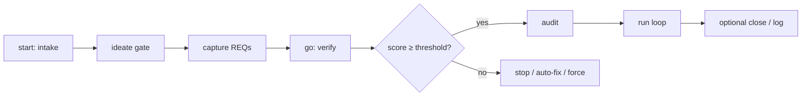

# do-work — Architecture Analysis Report

| | |
|---|---|
| **Date** | 2026-08-11 |
| **UR** | UR-001 |
| **Project** | do-work (skill repo) |
| **Active tracker** | `sqlite` (`.do-work/work.db` sole work-item store) |
| **Method** | Read-only inventory of `SKILL.md`, `agents/`, `lib/`, `references/`, `docs/`, config load path, and standing process lessons |

---

## Executive summary

**do-work** is an agent-harness skill that turns a natural-language brief into traceable work items (UR → REQs), then executes them under TDD isolation (worktrees), with claim/heartbeat coordination, evidence + review gates, and merge into a recorded integration base. There is no daemon: coordination is files + shell + optional remote stores.

**Storage split (load-bearing):**

| Domain | Where it lives |
|--------|----------------|
| Work items (URs, REQs, claims, decisions, verify/close) | Active **tracker backend** only: `markdown` \| `linear` \| `sqlite` |
| Runtime (worktrees, branches, merges, `state/*` locks, config) | **Always local** to the project |

**Primary loop:** `/do-work start` (intake → ideate → capture) then `/do-work go` (verify → audit → run → optional close/log).

**Top risks for operators and maintainers:**

1. **Backend split-brain** — treating residual markdown trees as live truth when `tracker.backend` is `sqlite` or `linear`.
2. **Instruction surface area** — large phase agents (`capture`, `run-worker`, deep `references/`) force high token load and drift risk across backends.
3. **Integration-base drift** — Stage B merge onto the wrong branch when the orchestrator shell is not re-asserted against the recorded base.

**Top recommendations (see §Recommendations):**

1. **P0** — Keep a single “live store” banner in status/help when backend ≠ markdown.
2. **P0** — Continue progressive disclosure: lean `SKILL.md` + on-demand agents/refs (already directionally correct; enforce size budgets).
3. **P1** — Backend parity test matrix for port ops (claim/deps/footprint/archive) across markdown/linear/sqlite.

---

## Audience map

| Persona | Read first | Then |
|---------|------------|------|
| **Owner** (product direction) | Executive summary, Recommendations, Non-goals | Inventory (high level) |
| **Architect** (skill design) | Primary loop, Tracker & storage, Runtime, Recommendations | Agent catalog, field-lesson classes |
| **Operator / user** (runs `/do-work` on projects) | Primary loop happy path, Recovery, Troubleshooting links | Tracker: which backend is live, status/resume/unblock |

---

## Table of contents

1. [Inventory](#1-inventory)
2. [Primary loop and phase agents](#2-primary-loop-and-phase-agents)
3. [Tracker and multi-backend storage](#3-tracker-and-multi-backend-storage)
4. [Runtime execution](#4-runtime-execution)
5. [Agent catalog](#5-agent-catalog)
6. [Processes and control planes](#6-processes-and-control-planes)
7. [Recommendations](#7-recommendations)
8. [Non-goals and anti-patterns](#8-non-goals-and-anti-patterns)
9. [Related docs](#9-related-docs)

---

## 1. Inventory

### 1.1 Top-level layout

```text
do-work/
├── SKILL.md                 # Entrypoint: commands, dispatch, hard-stops, skill-root
├── agents/                  # Phase agents + tracker backends
│   └── tracker/             # port.md + markdown | linear | sqlite
├── lib/                     # Deterministic shell (claim, pick, dw-db, worktrees, …)
├── references/              # On-demand depth (run-loop, parallel, tracker, field-lessons)
├── docs/                    # Operator + design documentation
└── .do-work/                # Project runtime state (config, work.db, evidence, …)
```

### 1.2 Live vs historical work-item truth (this project)

| Artifact | Role when `tracker.backend: sqlite` |
|----------|-------------------------------------|
| `.do-work/work.db` | **Sole** work-item store |
| `.do-work/board/index.html` | Static HTML snapshot (`/do-work board` only) |
| `.do-work/user-requests/`, root `REQ-*.md`, `archive/` trees | **Historical only** — not live ops |
| `.do-work/config.yml`, `state/*`, worktrees | Local runtime (always) |

Greenfield rule: switching to sqlite does **not** import markdown history. First ensure creates empty schema.

### 1.3 Phase agents (`agents/*.md`)

| Agent | Role |
|-------|------|
| `start.md` | Orchestrator: intake → ideate → capture |
| `go.md` | Orchestrator: verify → (threshold) audit → run → close offer → log |
| `intake.md` | Record brief verbatim as next UR |
| `ideate.md` | Explorer / Challenger / Connector review + interactive gate |
| `question.md` | Grill the brief (assumptions / gaps) |
| `capture.md` | Decompose brief → REQs (path-units, layers, integration) |
| `verify.md` | Coverage score vs brief (`score-coverage.sh`) |
| `audit.md` | REQ quality sharpening before run |
| `run.md` | Orchestrator: claim/dispatch/integrate loop |
| `run-worker.md` | Worker: TDD + verify one REQ in isolation |
| `review.md` | Post-build gate before archive |
| `status.md` | Situation room (claims, heartbeats, coverage) |
| `board.md` | SQLite HTML board regeneration |
| `close.md` | UR-level path-unit closure vs brief |
| `unblock.md` / `resume.md` | Recovery: backlog return / re-dispatch |
| `upgrade.md` | Conformance fixes + optional migrate |
| `log.md` | Build-in-public draft posts |
| `retro.md` | Ledger → calibration.md learning |
| `help.md` | Contextual help |
| `config.md` | Shared Load Config (backend resolve, skill-root) |

### 1.4 Tracker backends (`agents/tracker/`)

| File | Role |
|------|------|
| `port.md` | Shared op catalog, claim/deps/footprint rules, hard-stop matrix |
| `markdown.md` | Default: `.do-work/` files + `lib/*.sh` |
| `linear.md` | Linear Issues + UR Project Milestones + claim comments |
| `sqlite.md` | `lib/dw-db.sh` + `work.db` sequences |

### 1.5 Key `lib/*.sh` (determinism surface)

| Cluster | Scripts (representative) |
|---------|---------------------------|
| **Work items (markdown)** | `claim-req.sh`, `pick-req.sh`, `heartbeat.sh`, `check-deps.sh`, `check-footprint.sh`, `scan-stale.sh` |
| **Work items (sqlite)** | `dw-db.sh` (create/list/claim/heartbeat/archive/board/status-synth, …) |
| **Coverage / gates** | `score-coverage.sh`, `check-acceptance-evidence.sh`, `check-policy.sh`, `check-archive-integrity.sh`, `cycle-check.sh` |
| **Git isolation** | `provision-worktree.sh`, `ensure-integration-base.sh` |
| **Observability** | `run-ledger.sh`, `synth-status.sh`, `coverage-rollup.sh`, `retro-rollup.sh`, `emit-event.sh` |
| **Install / conformance** | `conformance-scan.sh`, `install-target.sh`, `file-feedback.sh` |

Approx. size (this tree): ~7.5k lines across `lib/*.sh`; ~7.8k lines across `agents/**/*.md` (skewed by `capture.md`).

### 1.6 References (on-demand)

| Reference | When loaded |
|-----------|-------------|
| `commands.md` | Subcommand stubs / install template |
| `concepts.md` | Naming, path-units, commits, recovery |
| `run-loop.md` / `run-parallel.md` | Serial + parallel run body |
| `tracker.md` / `linear-*.md` | Multi-tracker deep dive |
| `field-lessons.md` | Skill-process lessons (read at skill start) |

### 1.7 Docs entry points

| Doc | Purpose |
|-----|---------|
| [getting-started.md](getting-started.md) | Install + first happy path |
| [concepts.md](concepts.md) | Mental model |
| [commands.md](commands.md) | Command/flag reference |
| [HOW-IT-WORKS.md](HOW-IT-WORKS.md) | Phase-by-phase design |
| [troubleshooting.md](troubleshooting.md) | Symptom → fix |
| [skill-best-practices-findings.md](skill-best-practices-findings.md) | Skill packaging rubric inventory |

---

## 2. Primary loop and phase agents

### 2.1 Happy path



| Command | What happens |
|---------|----------------|
| `/do-work start [brief]` | Record UR + ideate (default) + capture REQs |
| `/do-work go [UR]` | Verify coverage; if ≥ `verify.threshold` (default 90), audit + run |
| `/do-work status` | Live situation room |
| Granular | `intake`, `capture`, `verify`, `run`, `close`, … |

### 2.2 Orchestrators vs workers vs gates

| Kind | Agents | Owns |
|------|--------|------|
| **Orchestrator** | `start`, `go`, `run` | Sequencing, claim pick, merge/archive, user gates |
| **Worker** | `run-worker` | Single REQ: TDD, verification steps, one commit tip |
| **Quality gates** | `verify`, `audit`, `review`, `close` | Coverage, criteria sharpness, post-build, UR closure |
| **Recovery** | `status`, `unblock`, `resume` | Visibility and unstick without dual-write |

### 2.3 Artifact flow (conceptual)

```text
Brief (UR)
  → ideate / clarifications / open_gaps
  → REQ backlog (path-unit parents + layer children, or legacy flat REQs)
  → claim + heartbeat
  → worktree + implementation + evidence
  → review gate
  → archive + optional ledger note
  → UR close (path-units) / retro calibration
```

### 2.4 Entry gates (every phase that touches work)

1. **Project root** — `git rev-parse --show-toplevel` (or CWD).
2. **Skill-root** — walk-up from loaded instruction file to dir with `lib/` + (`SKILL.md` \| `agents/`). No env/hub/CWD fallback. Hard-stop if unknown.
3. **Conformance scan** — read-only detectors; only safe-blocking auto-fixes at startup.
4. **Load Config** — migrate missing keys; resolve `tracker.backend`; validate linear/sqlite when selected.
5. **Port load** — `port.md` → `tracker/<backend>.md` → **named ops only**.

**Skill directory is read-only at runtime** when the skill is loaded from a hub clone: product edits land in `{project}`, never in the skill install path (except when the project *is* the skill repo).

---

## 3. Tracker and multi-backend storage

### 3.1 Load path

```text
config.yml → tracker.backend
  → agents/tracker/port.md
  → agents/tracker/{markdown|linear|sqlite}.md
  → named port ops only
```

Unset / empty backend → **markdown** (no Linear/`sqlite3` required).

### 3.2 Backend comparison

| Concern | markdown | linear | sqlite |
|---------|----------|--------|--------|
| **UR home** | `user-requests/UR-NNN/input.md` | Project Milestone on shared product Project | `urs` + artifacts in `work.db` |
| **REQ home** | `.do-work/REQ-*.md` | Issues (Linear ids) | `reqs` rows (`REQ-NNN` slugs) |
| **Claim** | FS stamp + `working/` | Workflow state + claim comment | `claims` table |
| **Deps authority** | REQ header | Native `blocks` relations (body mirror) | `deps` table |
| **Decisions** | `decisions.md` | Team Doc | `decisions` table |
| **Board** | n/a | Linear UI | Static HTML via `/do-work board` |

### 3.3 Hard rules (architecture invariants)

| Rule | Why |
|------|-----|
| **No dual-write** | Two stores diverge under concurrency; recovery becomes unprovable |
| **Hard-stop, never silent fallback** | Silent markdown fallback under Linear/sqlite hides misconfiguration |
| **Mid-flight failure → leave claimed** | Avoid races; operator uses `resume` / `unblock` after store health returns |
| **Work-item vs runtime split** | Git isolation and locks must work even when the tracker is remote |

### 3.4 Product containers

- **Linear:** one shared **product Project** (`product_project` resolve chain → UUID bind); each UR is a **Project Milestone** (not Initiative — MCP has no Initiative create).
- **SQLite:** DB ensure creates schema; no product Project abstraction beyond the project root.
- **Markdown:** directories under `.do-work/`.

### 3.5 Migrate

`migrate_markdown_to_linear` is idle-only, refuse if already `sqlite`/`linear`, no partial cutover. **No markdown→sqlite history migration in v1** (greenfield).

---

## 4. Runtime execution

### 4.1 Claim eligibility

A REQ is claimable only when **all** hold:

1. Backlog-equivalent status  
2. Unclaimed (or stale claim recoverable)  
3. Dependencies **satisfied** (depended-on REQs done/archived)  
4. Footprint free vs other in-flight REQs  
5. In scope filters (UR / milestone)

**Heartbeat** refreshes liveness; silence beyond `parallel.stale_threshold_seconds` (default 900) → stale. Linear heartbeats must **patch** the claim comment, not create a second active claim (field lesson).

### 4.2 Worker contract (summary)

- One REQ per worker session (`run-worker.md`).
- TDD: failing test before implementation when the project’s test culture applies; docs REQs use typed verification steps (`runtime` / `test` / …).
- Verification steps must be **worker-executable** in the worktree; human/device checks go to **Manual checks (advisory)** and **never block merge**.
- Structured commit message with REQ/UR identity; branch `req/<id>`.

### 4.3 Worktrees and provision

- Isolation via git worktree + `provision-worktree.sh`.
- Auto-detect dep dirs (depth ≤ 1): `vendor`, `node_modules`, `.venv`; extend with `worktree.link_paths`.
- **Field lesson:** Laravel + Pest needs a **real** `composer install` in the worktree, not a `vendor` symlink.
- **Field lesson:** nested monorepo packages beyond depth 1 need explicit `link_paths`.

### 4.4 Review and archive

1. Acceptance evidence (`acceptance.evidence_required`)  
2. Policy check (`check-policy.sh` — blocked paths/commands, risk signals)  
3. Review gate (`review.required`; optional adversarial multi-lens)  
4. Archive via backend (`archive_req` / file move / dw-db)  
5. Optional local ledger (telemetry only when work-items are remote)

### 4.5 Integration base (Stage B)

- `ensure-integration-base.sh` records the integration branch (leave-default: `new-work` when on protected default; **skip if already on a feature branch**).
- **Field lesson:** before **every** merge, assert `git branch --show-current` equals the **recorded** base — never merge “wherever HEAD is.”
- Delivery: `delivery.mode` = `merge` (default) or `pr` (requires remote + `gh`; never silent fallback to merge).

### 4.6 Parallelism

- `--parallel N` or `parallel.max_workers` (cap 10).
- Concurrent Stage A workers; **serialized** Stage B merge queue.
- Footprint overlap and deps still gate claimability.
- iOS: unique `derivedDataPath` per REQ (field lesson).

### 4.7 Recovery

| Situation | Command |
|-----------|---------|
| Stuck in-flight | `/do-work status` then `unblock` or `resume` |
| Stale heartbeat | status triage; reclaim per multi-agent rules |
| Wrong backend assumption | hard-stop messages; fix config, do not dual-write |

---

## 5. Agent catalog

### 5.1 Command → agent map

| Operator intent | Agent |
|-----------------|-------|
| New work from a brief | `start` → intake, ideate, capture |
| Ship the backlog | `go` → verify, audit, run |
| Coverage only | `verify` |
| Execute only | `run` (+ `run-worker` per REQ) |
| Stuck? | `status`, `unblock`, `resume` |
| UR done? | `close` |
| Learn from runs | `retro` |
| Bring project state current | `upgrade` |
| SQLite board | `board` |

### 5.2 Complexity hotspots

| Area | Why it is hot |
|------|----------------|
| `capture.md` | Path-units, layers, integration pass, quality scanners, multi-backend branches |
| `run.md` + `run-loop` / `run-parallel` | Claim races, parallel merge queue, budget, milestone gates |
| `config.md` | Large schema + backend validation + skill-root recipe |
| Tracker trio | Same semantics, three representations; parity is the product |

### 5.3 Routing

`config.routing` is an ordered list of `{match, agent}` rules for run dispatch. Ships **empty** → all REQs to `general-purpose` (portable). Specialist agents are opt-in per machine.

---

## 6. Processes and control planes

### 6.1 Control planes

| Plane | Mechanism |
|-------|-----------|
| **Work-item lifecycle** | Tracker port ops |
| **Git lifecycle** | Branches, worktrees, merge/PR |
| **Orchestrator coordination** | `state/*` locks, events, heartbeats |
| **Quality** | verify score, audit, review, acceptance evidence, suite command |
| **Learning** | field-lessons (skill process), retro calibration, decisions memory |
| **Conformance** | `conformance-scan.sh` + `/do-work upgrade` |

### 6.2 Capture classes

| Class | Behavior |
|-------|----------|
| `feature` | Layers + integration prompts |
| `bug-fix` | Minimal; `Layer: none` |
| `other` | User picks minimal vs feature-style |

Layers come from `config.layers` (this repo: `[agents, commands, templates]`). Empty layers + feature brief → capture halt unless `--no-layers`.

### 6.3 Path-units vs legacy REQs

- **Path-unit:** non-empty Entry point + Terminal state; children carry `Parent`.
- **Legacy / docs / bug-fix:** empty path fields; still valid.
- **Close** walks path-units in the merged app; skipped when none exist.

### 6.4 Field lessons (skill-process classes)

Read `references/field-lessons.md` at skill start. Capture only lessons that improve the **next do-work run** (not product domain notes). Current classes include: Laravel real vendor, Linear claim patch-only, monorepo provision depth, path-unit empty commit, Stage B base assert, sqlite empty-column separators, parallel iOS DerivedData, Linear vs markdown-only capture hard-stop.

---

## 7. Recommendations

Each item: **what** · **why** · **who benefits**. Priority: P0 (now) / P1 (next) / P2 (later).

### P0 — Operation and truth

| # | Recommendation | Why | Who |
|---|----------------|-----|-----|
| R1 | **Surface active backend on every status/help/start report** (one line: `tracker: sqlite · work.db`). | Operators routinely confuse residual markdown with live store after backend flips. | Operator, Owner |
| R2 | **Keep skill-root hard-stop + read-only skill install rule non-negotiable** in all new agents. | Self-hosting confusion (edit hub vs project) is a recurring failure class. | Architect, Operator |
| R3 | **Assert integration base before every Stage B merge** (already field-lesson; bake into run checklist tests if missing). | Silent checkout drift merges REQs onto the wrong branch. | Operator, Architect |

### P1 — Architecture and parity

| # | Recommendation | Why | Who |
|---|----------------|-----|-----|
| R4 | **Port-op parity matrix + automated tests** across markdown / linear / sqlite for claim, deps, footprint, archive, list-claimable. | Three backends with one catalog drift in edge cases (empty fields, stale claims). | Architect |
| R5 | **Progressive disclosure budget**: keep `SKILL.md` lean; move procedural depth only into one-hop `agents/` / `references/`; split `capture.md` themes (path-unit vs layer vs integration) if it keeps growing. | Token load and drift rise with mega-agents; packaging rubric already flags this. | Architect, Owner |
| R6 | **Operator “stuck REQ” runbook card** in troubleshooting: status → resume vs unblock decision tree with Linear claim-comment warning. | Recovery is powerful but under-discovered under stress. | Operator |
| R7 | **Document greenfield sqlite limits** next to board: no history migrate, residual markdown is archaeology, `/do-work board` is snapshot-only. | This project already hits the confusion; future products will too. | Operator, Owner |

### P2 — Productization and UX

| # | Recommendation | Why | Who |
|---|----------------|-----|-----|
| R8 | **Optional routing presets** (commented blocks → “Laravel pack”, “skill-author pack”) installable without inventing default machine-specific agents. | Empty `routing: []` is correct for portability; packs lower setup cost. | Owner, Operator |
| R9 | **Cost budget + adversarial review** defaults only after budget enforcement is trustworthy. | Multi-reviewer cost without caps burns money. | Owner |
| R10 | **Retro → capture calibration loop** metrics: how often verify fails, footprint conflicts, stale claims. | Closes the learning loop beyond narrative field lessons. | Architect |
| R11 | **Consider extracting pure libraries** (score-coverage, cycle-check, claim protocol) as versioned scripts with golden tests only — not a second skill. | Determinism already lives in `lib/`; packaging clarity helps contributors. | Architect |

### Cross-cutting quality bars for future changes

- Any new work-item field must land in **port.md + all three backends** or be explicitly runtime-only.
- Any new gate must define: **who runs it**, **what evidence**, **stopper vs advisory**.
- Any new parallel behavior must state: **what is concurrent**, **what is serialized**.

---

## 8. Non-goals and anti-patterns

Do **not** treat these as improvements without an explicit design break:

| Anti-pattern | Why it fights the architecture |
|--------------|--------------------------------|
| Dual-write markdown + Linear/sqlite “for safety” | Guaranteed split-brain |
| Silent fallback when active backend is down | Hides config failures; corrupts recovery |
| Human/device validation as a merge gate | Strands worktrees; superseded standing decision: advisory only |
| Daemon / central queue as default coordinator | Throws away file-based multi-agent auditability |
| Inventing Initiative-based Linear hierarchy | MCP cannot create Initiatives; milestones are intentional |
| Markdown→sqlite history migrate as casual upgrade | Explicitly out of v1; greenfield only |
| Editing hub skill clones as the project | Runtime skill path is read-only for product work |

---

## 9. Related docs

| Doc | Link |
|-----|------|
| Getting started | [getting-started.md](getting-started.md) |
| Concepts | [concepts.md](concepts.md) |
| Commands | [commands.md](commands.md) |
| How it works | [HOW-IT-WORKS.md](HOW-IT-WORKS.md) |
| Troubleshooting | [troubleshooting.md](troubleshooting.md) |
| Skill packaging findings | [skill-best-practices-findings.md](skill-best-practices-findings.md) |
| Entrypoint | [../SKILL.md](../SKILL.md) |
| Config schema | [../agents/config.md](../agents/config.md) |
| Tracker port | [../agents/tracker/port.md](../agents/tracker/port.md) |
| Field lessons | [../references/field-lessons.md](../references/field-lessons.md) |

---

## Appendix A — Port ops (index)

`ensure_product_container`, `create_ur`, `read_ur`, `list_urs`, `append_ideate`, `append_clarifications`, `create_req`, `update_req`, `read_req`, `list_reqs_for_ur`, `list_claimable_reqs`, `claim_req`, `heartbeat_req`, `set_req_status`, `set_blocked_by`, `set_files`, `archive_req`, `unblock_req`, `append_decision`, `write_verify_report`, `write_close_report`, `append_run_note`, `read_active_milestone`, `set_active_milestone`, `list_milestone_reqs`, `write_gate_state`, `migrate_markdown_to_linear`.

Full contracts: [../agents/tracker/port.md](../agents/tracker/port.md).

---

## Appendix B — Report provenance

| REQ | Contribution |
|-----|----------------|
| REQ-001 | Inventory, live vs historical truth |
| REQ-002 | Primary loop and phase graph |
| REQ-003 | Tracker multi-backend architecture |
| REQ-004 | Runtime: claim, worktree, review, parallel, recovery |
| REQ-005 | Ranked recommendations + non-goals |
| REQ-006 | Executive summary, audience map, TOC, docs index link |

*End of report.*
